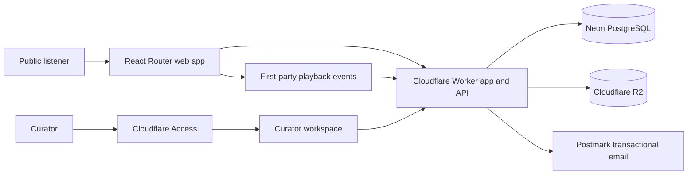

# MVP architecture

This document describes the intended production architecture for the Sunstruck Synapse Radio MVP. The repository is still a static HTML, CSS, and JavaScript prototype: none of the application services, data stores, authentication, email, analytics, or controlled media delivery described here has been implemented.

The accepted architecture decisions are:

1. [React Router 7 and TypeScript](decisions/0001-react-router-typescript.md)
2. [Cloudflare Workers runtime and deployment](decisions/0002-cloudflare-workers-runtime.md)
3. [Neon PostgreSQL and Drizzle](decisions/0003-neon-postgresql-drizzle.md)
4. [Cloudflare R2 media storage and controlled delivery](decisions/0004-r2-media-storage-delivery.md)
5. [Cloudflare Access for initial curator authentication](decisions/0005-cloudflare-access-curator-auth.md)
6. [Postmark for transactional email](decisions/0006-postmark-transactional-email.md)
7. [First-party, privacy-conscious analytics](decisions/0007-first-party-analytics.md)
8. [No Kubernetes dependency](decisions/0008-no-kubernetes.md)

## Intended production shape

The Cloudflare Worker is the production application boundary: it serves or supports the public application, exposes application APIs, authorizes curator and media requests, records semantic playback events, and integrates with managed data, object storage, and email services. The diagram is deliberately compact; it is a target architecture, not a claim about the current prototype.

## Trust boundaries

| Boundary | Trust and access expectation |
| --- | --- |
| Public listener | Untrusted internet client. May browse published catalogue data and request controlled public derivative media, but receives no database, master-media, evidence, or curator credentials. |
| Curator | Identified staff user admitted to the initial curator workspace through Cloudflare Access. Curator identity does not grant direct database or storage credentials. |
| App and API | Cloudflare Worker validates input, applies authorization, limits exposed fields, and mediates database, R2, email, and analytics operations. Browser input and forwarded identity claims remain untrusted until validated. |
| Database | Private service boundary holding catalogue, editorial, lifecycle, rights, provenance, and asset-reference records. It is never accessed directly by a browser. |
| Public derivative media | Publishable artwork and listening derivatives use controlled delivery and cache policy. They are distributable media, not confidential masters. |
| Private master and evidence media | Original masters and submission evidence use separate private scopes and credentials. They are never exposed through a public route. Evidence receives at least the protections applied to masters. |
| Third-party email | Postmark receives only the recipient and transactional content required to deliver a message. It is not an analytics, marketing, identity, or source-of-record boundary. |

## Local and production separation

Local development must be useful without weakening production boundaries.

| Concern | Local or non-production | Production |
| --- | --- | --- |
| Database | Separate credentials and a Neon development branch or equivalent isolated database. Docker PostgreSQL may be used for offline work, using the same migrations. | Dedicated Neon production project or branch and production-only credentials. |
| Application runtime | Wrangler's local Worker runtime, with explicit local bindings and environment-variable validation. | Cloudflare Workers with production bindings and validated required configuration. |
| Object storage | R2 emulation or a non-production bucket containing disposable fixtures. | Separate R2 scopes or buckets and credentials for derivatives, masters, and evidence. |
| Email | Postmark test mode or an explicit non-delivering adapter. | Postmark server token restricted to transactional application email. |
| Curator identity | An explicit local curator identity simulation may stand in for Cloudflare Access during development. That bypass must be impossible to enable in production. | Verified Cloudflare Access identity at the curator workspace boundary. |
| Analytics | No-op collection or structured local logging. | First-party semantic events sent through the application boundary. |
| Secrets | Developer-specific environment values outside source control. Production values are not required for ordinary local work. | Secrets and credentials supplied through the deployment environment; no production secrets in source. |
| Private media | Synthetic fixtures by default. Developers do not download production masters or evidence for routine local work. | Private assets remain in their restricted storage scopes. |

Configuration must fail clearly when required environment variables or bindings are missing. A local default must never silently select a production database, bucket, email sender, identity bypass, or analytics destination.

## Data and media boundaries

PostgreSQL stores catalogue, editorial, rights, provenance, submission-lifecycle metadata, and references to media assets. Large media files do not belong in Git or PostgreSQL.

Original masters, listening derivatives, artwork derivatives, and submission evidence have distinct storage and access policies. They should use separate scopes or buckets and credentials where practical:

- Masters and evidence remain private and are never served by a public route.
- Published artwork and audio derivatives are delivered through application-controlled access, with short-lived signed access, deliberate caching, and byte-range support for audio playback.
- Signed URLs reduce casual hotlinking and uncontrolled long-lived access; they are not DRM and cannot prevent a determined listener from capturing media they can play.
- Submission evidence is treated as stricter private material, not as a publishable derivative.
- Transcoding and derivative generation are deferred implementation work. The architecture preserves separate source and derivative identities without selecting a media-processing pipeline yet.

## Deferred details

These decisions choose service boundaries and responsibilities, not a finished schema or implementation. Database tables, listener and artist authentication, submission workflows, media-transcoding jobs, detailed retention periods, event schemas, and deployment automation require follow-up design. The MVP architecture has no technical dependency on LEMM.

Related work: [Phase 0 epic #4](https://github.com/svdb-hotmail/sunstrucksynapse.com/issues/4) and [architecture issue #11](https://github.com/svdb-hotmail/sunstrucksynapse.com/issues/11).
